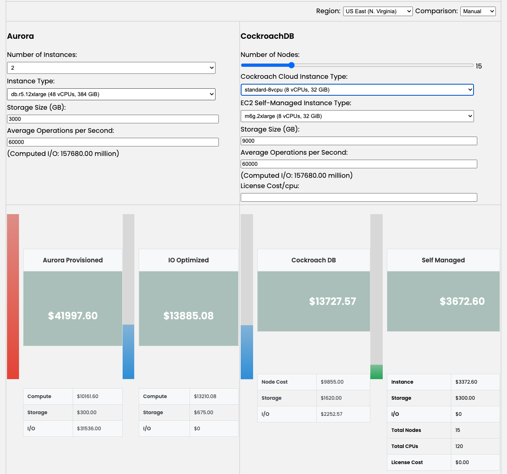

# costCalculator - compares the cost of Cockroach DB cloud and Cockroach DB self managed versus competitors
## Purpose
This cost calculator compares the cost of Cockroach DB cloud and Cockroach DB self managed versus competitors.  Currently, only Aurora is available.
## Outline
- [Purpose](#purpose)
- [Dynamic and static versions](#dynamic-and-static-versions)
- [Preparation steps](#preparation-steps)
  - [Clone the repository](#clone-the-repository)
  - [Prepare for Dynamic data load](#prepare-for-dynamic-data-load)
    - [Set up python environment](#set-up-python-environment)
    - [Fetch pricing information](#fetch-pricing-information)
    - [Start python http server](#start-python-http-server)
- [Open a file using browser](#open-a-file-using-browser)
## Usage

* Start in Automatic comparison mode and set up the Aurora side using the Instant Type dropdown as well as the storage size and the operations per second
  * In Automatic mode
    * Defaults will be set up for the EC2 and Cockroach Cloud instance types
    * CockroachDB Storage size will be calculated from the Aurora storage size (3x)
    * CockroachDB Operations per second will be copied from the Aurora entry
  * In Manual mode, the two sides are independent
    * A license cost can be added-reflected in the self managed total cost
## Dynamic and static versions
* The dynamic versions have a retrieval python step to download the current AWS aurora and ec2 costs for use with versions.
* The static versions have the costs hardcoded into the driver program
  * So, there is a risk of stale data with the static versions and it also is a less complete set of data than is dynamically loaded
  * Best to use dynamic versions

## Preparation steps
### Clone the repository
* Pull this github into a directory
```bash
git clone https://github.com/jphaugla/costCalculator.git
```
### Prepare for Dynamic data load
If static version are good enough, this step can be skipped
To use the dynamic version, the latest pricing information needs to be downloaded
#### Set up python environment
```bash
cd costCalculator/pricing
python3 -m venv venv
source venv/bin/activate
pip install -r requirements.txt
```
#### Fetch pricing information
If static version are good enough, this step can be skipped
* The cockroach pricing content is a static file at [cockroachCloud_pricing.csv](pricing/cockroachCloud_pricing.csv)
* The [ec2_pricing.csv](pricing/ec2_pricing.csv) and [aurora_pricing.csv](pricing/aurora_pricing.csv) are not included in the repository
* Both of these files rely on first downloading the original json files which are also not included in the repository
  * [ec2_pricing.json](pricing/ec2_pricing_raw.json)
  * [aurora_pricing.json](pricing/aurora_pricing_raw.json) 
* All of this is handled by running a python program to download the raw files and subsequently create the csv files
  * If a previous file is found, the fetching program will ask if the file should be overwritten or not.  
  * These  very large fails can take a long time to download and process.
  * This is the python program [fetch_all_aws.py](pricing/fetch_all_aws.py)
```bash
# make sure to be in costCalculator/pricing
python fetch_all_aws.py
  ```
#### Start python http server
* If static version are good enough, this step can be skipped
* Browser security doesn't allow to load files from the browser so an http server must run in the directory where the pricing files are located
```bash
# make sure to be in costCalculator/pricing
# this will run in the background on port 8000
./start_http.sh
# if a different port is needed, pass the port number as the first parameter to the start_http.sh script
./start_http.sh 8001
# 
  ```
### Open a file using browser
Choose desired file and open it in the browser using File->Open File method
* Static files
  * Aurora.html - standard cost calculator. 
  * AuroraOpt.html - cost calculator with a self managed cost optimization option involving choosing to idle machines
* Dynamic file
  * AuroraDynamic.html - cost calculator using downloaded aws cost information
NOTE:  If port 8000 was not used (it is the default).  Change the open of the html file to be
```bash
file:///PathToGit/costCalculator/AuroraDynamic.html?port=8001
```
